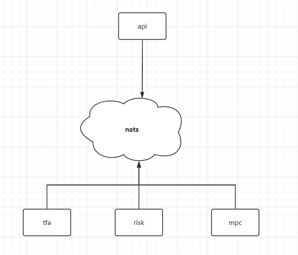

# mpcdeploy

## docker

### ngnix

```
docker run --name nginx -p 80:80  -p 443:443 -v /root/docker/nginx/mixmarvel.com_server.crt:/etc/nginx/mixmarvel.com_server.crt -v /root/docker/nginx/mixmarvel.com_server.key:/etc/nginx/mixmarvel.com_server.key -v /root/docker/nginx/mpc-svr-dev.mixmarvel.com.conf:/etc/nginx/conf.d/mpc-svr-dev.mixmarvel.com.conf -v /root/docker/nginx/dailCode.json:/etc/nginx/dailCode.json -d nginx
```

### mysql

```
docker run --name mysql  -p 3306:3306 -e MYSQL_ROOT_PASSWORD=123456 -d mysql
```

### postgres

```
docker run -d -p 5432:5432 -e POSTGRES_PASSWORD=123456   -v /root/docker/postgres/my-postgres.conf:/etc/postgresql/postgresql.conf -v /root/db/postgres/data:/var/lib/postgresql/data  postgres:12.3 -c config_file=/etc/postgresql/postgresql.conf
```

### redis

```
redis-server  ./redis.conf
```

### nats

```
docker network create nats
```

```
docker run --name nats --network nats -d -p 4222:4222 -p 8222:8222 nats --http_port 8222 --cluster_name NATS --cluster nats://0.0.0.0:6222
```

```
docker run --name nats-1 -p 4211:4222 --network nats -d nats --cluster_name NATS --cluster nats://0.0.0.0:6211 --routes=nats://nats:6222
```

##

---


